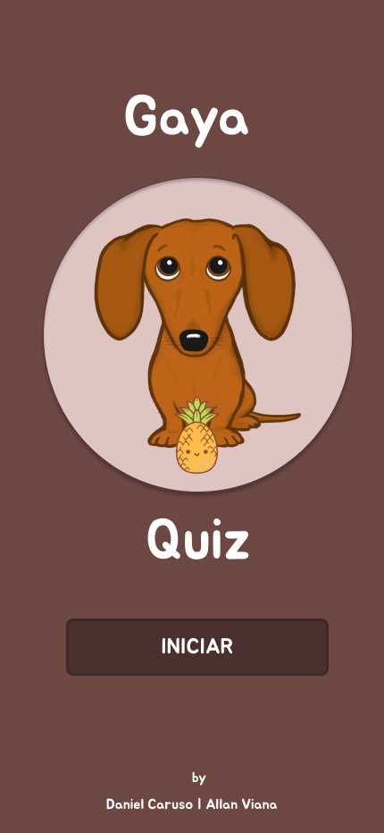
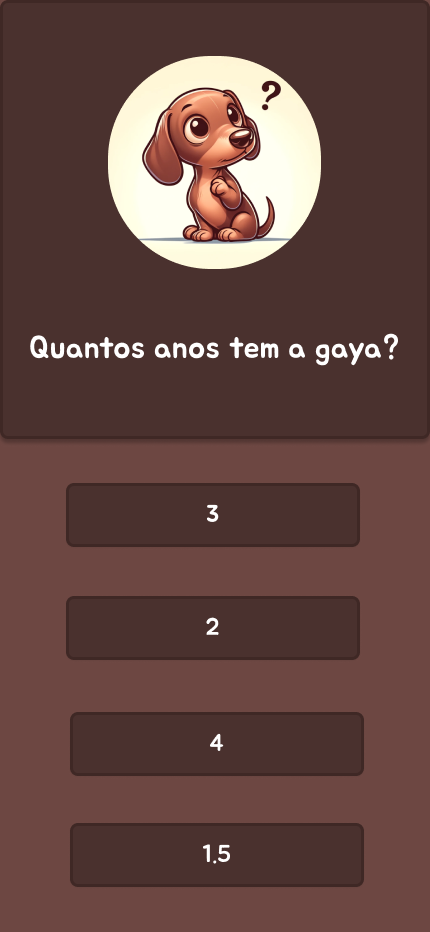
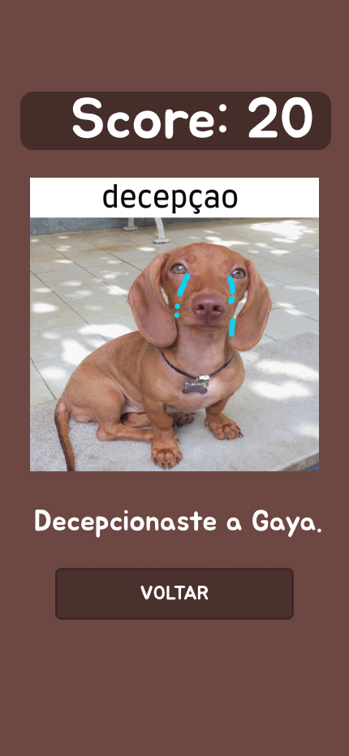

# GayaQuiz

**GayaQuiz** is an app I made for my girlfriend, inspired by her love for her Dachshund, Gaya. It’s a fun way to share little details about Gaya, like her age or favorite things, through a playful quiz. Each screen is filled with cute illustrations of Gaya, making it enjoyable and personal. At the end, users get their score and a fun reaction from Gaya, whether happy or disappointed. This app is my way of celebrating how special Gaya is to us.

---

## Screenshots

| Welcome Screen                          | Gameplay Screen                           | Result Screen                           |
|-----------------------------------------|-------------------------------------------|-----------------------------------------|
|  |  |  |

## Technologies Used

- **Swift**: Implemented for handling the core logic and managing game functionality.
- **SwiftUI**: Utilized to design the app's user interface with a declarative approach.
- **MVVM Architecture**: Ensures a clear separation between the UI (View) and business logic (ViewModel).
- **Xcode**: The primary IDE used for development and testing the application.

---
